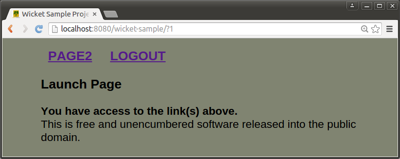
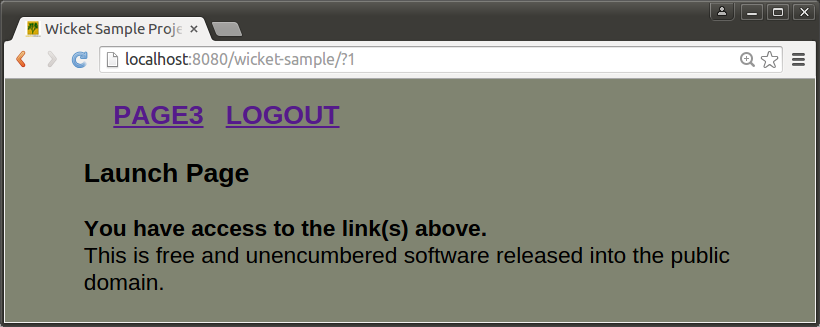

# wicket-sample ENABLE FORTRESS README

 This document demonstrates how to enable java EE and fortress security in the wicket sample app.

-------------------------------------------------------------------------------

## Prerequisites for target machine:
1. Debian or Redhat Liunx machine with OpenSSL installed.

2. Java 7 (or greater) sdk

3. Git

4. Apache Maven 3

5. Firefox Web Browser

6. Completion of steps in [wicket-sample README.md](README.md)

7. Completion of the [Apache Fortress Ten Minute Guide](http://symas.com/javadocs/apache-fortress-core/org/apache/directory/fortress/core/doc-files/ten-minute-guide.html):
    * [Setup Apache Directory Server](http://symas.com/javadocs/apache-fortress-core/org/apache/directory/fortress/core/doc-files/apache-directory-server.html)
    * [Setup Apache Directory Studio](http://symas.com/javadocs/apache-fortress-core/org/apache/directory/fortress/core/doc-files/apache-directory-studio.html)
    * [Build Apache Fortress Core](http://symas.com/javadocs/apac1he-fortress-core/org/apache/directory/fortress/core/doc-files/apache-fortress-core.html)
    * [Build Apache Fortress Realm](http://symas.com/javadocs/apache-fortress-core/org/apache/directory/fortress/core/doc-files/apache-fortress-realm.html)
    * [Setup Apache Tomcat Web Server](http://symas.com/javadocs/apache-fortress-core/org/apache/directory/fortress/core/doc-files/apache-tomcat.html)
    * [Build Apache Fortress Web](http://symas.com/javadocs/apache-fortress-core/org/apache/directory/fortress/core/doc-files/apache-fortress-web.html)

-------------------------------------------------------------------------------

## Steps to enable java EE and fortress security:

1. Add the static /login html files

 * If you downloaded the wicket-sample source, this is already taken care of.

2. Add LoginPage, LogoutPage java and html

 * Again these are already part of the wicket-sample source distro.

3. Edit the pom.xml
    * uncomment the dependencies near the top
```
        <!-- TODO STEP 3: uncomment for fortress & security dependencies: -->
        <dependency>
            <groupId>org.apache.directory</groupId>
            <artifactId>fortress-web</artifactId>
            <version>${project.version}</version>
            <classifier>classes</classifier>
        </dependency>

        <dependency>
            <groupId>org.springframework</groupId>
            <artifactId>spring-web</artifactId>
            <version>${spring.version}</version>
        </dependency>

        <dependency>
            <groupId>org.springframework</groupId>
            <artifactId>spring-expression</artifactId>
            <version>${spring.version}</version>
        </dependency>

        <dependency>
            <groupId>xml-apis</groupId>
            <artifactId>xml-apis</artifactId>
            <version>1.4.01</version>
        </dependency>

```


  * uncomment the maven ant task near the bottom
```
...
    <plugin>
        <artifactId>maven-antrun-plugin</artifactId>
        <version>1.7</version>
        <executions>
            <execution>
                <phase>test</phase>
                <configuration>
                    <target name="fortress-load"
...
```

 Now the necessary binaries will be available to the app.

4. Edit the web.xml
    * uncomment the spring settings
```
  <!-- TODO STEP 4a: uncomment to enable fortress spring bean injection: -->
  <context-param>
      <param-name>contextConfigLocation</param-name>
      <param-value>classpath:applicationContext.xml</param-value>
  </context-param>

  <listener>
      <listener-class>org.springframework.web.context.ContextLoaderListener</listener-class>
  </listener>
```


    * uncomment the java ee security constraints
```
    <!-- TODO STEP 4b: uncomment to enable Java EE Security -->
    <security-constraint>
        <web-resource-collection>
            <web-resource-name>app</web-resource-name>
            <url-pattern>/wicket/bookmarkable/org.wicketsample.LogoutPage</url-pattern>
        </web-resource-collection>
        &lt;!&ndash; OMIT auth-constraint &ndash;&gt;
    </security-constraint>
    <security-constraint>
        <display-name>Wicket Sample Security Constraints</display-name>
        <web-resource-collection>
            <web-resource-name>Protected Area</web-resource-name>
            <url-pattern>/wicket/*</url-pattern>
        </web-resource-collection>
        <auth-constraint>
            <role-name>wsBaseRole</role-name>
        </auth-constraint>
    </security-constraint>
    <login-config>
        <auth-method>FORM</auth-method>
        <realm-name>FortressRealm</realm-name>
        <form-login-config>
            <form-login-page>/login/login.html</form-login-page>
            <form-error-page>/login/error.html</form-error-page>
        </form-login-config>
    </login-config>
    <security-role>
        <role-name>wsBaseRole</role-name>
    </security-role>

    <error-page>
        <error-code>403</error-code>
        <location>/login/unauthorized.html</location>
    </error-page>
    <error-page>
        <error-code>404</error-code>
        <location>/login/pagenotfound.html</location>
    </error-page>
    <error-page>
        <error-code>500</error-code>
        <location>/login/unexpected.html</location>
    </error-page>
```


 After this step, java EE security has been enabled.

5. Rename context.xml.example to context.xml
```
<Context reloadable="true">

    <Realm className="org.apache.directory.fortress.realm.tomcat.Tc7AccessMgrProxy"
           debug="0"
           resourceName="UserDatabase"
           defaultRoles=""
           containerType="TomcatContext"
           realmClasspath=""
            />
</Context>
```

 The context.xml is how the fortress realm integrates with the sample wicket application.

6. Rename fortress.properties.example to fortress.properties.
```
# This param tells fortress what type of ldap server in use:
ldap.server.type=apacheds

# Use value from [Set Hostname Entry]:
host=localhost

# if ApacheDS is listening on TLS port:
port=10389

# These credentials are used for read/write access to all nodes under suffix:
admin.user=uid=admin,ou=system
admin.pw=secret

# This is min/max settings for LDAP administrator pool connections that have read/write access to all nodes under suffix:
min.admin.conn=1
max.admin.conn=10

# This node contains fortress properties stored on behalf of connecting LDAP clients:
config.realm=DEFAULT
config.root=ou=Config,dc=example,dc=com

# Used by application security components:
perms.cached=true

# Fortress uses a cache:
ehcache.config.file=ehcache.xml
```


 After completing the fortress ten minute guide, this step should be familiar to you.  It is where the fortress runtime is connected with a remote ldap server.

7. Edit WicketApplication.java
    * uncomment fortress session override
```
	// TODO STEP 7a: uncomment save fortress session to wicket session:
	@Override
	public Session newSession(Request request, Response response)
	{
		return new WicketSession(request);
	}
```


    * uncomment fortress spring bean injector
```
    // TODO STEP 7b: uncomment to enable injection of fortress spring beans:
    getComponentInstantiationListeners().add(new SpringComponentInjector(this));
```


 These steps are necessary to get fortress hooked into the sample app.

8. Edit WicketSampleBasePage.java
    * uncomment fortress spring bean injection
```
    // TODO STEP 8a: enable spring injection of fortress bean here:
    @SpringBean
    private AccessMgr accessMgr;
    @SpringBean
    private J2eePolicyMgr j2eePolicyMgr;

```

     These beans are how the app calls fortress

    * uncomment call to enableFortress
```
    // TODO STEP 8b: uncomment call to enableFortress:
    try
    {
        SecUtils.enableFortress( this, ( HttpServletRequest ) getRequest().getContainerRequest(), j2eePolicyMgr, accessMgr );
    }
    catch (org.apache.directory.fortress.core.SecurityException se)
    {
        String error = "WicketSampleBasePage caught security exception : " + se;
        LOG.warn( error );
    }
```


     Needed to manage the sessions on behalf of the users.

    * change to FtBookmarkablePageLink
```
        // TODO STEP 8c: change to FtBookmarkablePageLink:
        add( new FtBookmarkablePageLink( "page1.link", Page1.class ) );
        add( new FtBookmarkablePageLink( "page2.link", Page2.class ) );
        add( new FtBookmarkablePageLink( "page3.link", Page3.class ) );
```


 This component maps the page links to fortress permissions.

9. Edit Page1.java, Page2.java, Page3.java
    * change to FtIndicatingAjaxButton
```
    // TODO STEP 9a: change to FtIndicatingAjaxButton:
    add( new FtIndicatingAjaxButton( "page1.button1" )
```


 This component maps the page buttons to fortress permissions

10. Build & Deploy (run from the command line):

 Build the web app, loads the wicket sample security policy into ldap, and deploy into tomcat:
```
mvn clean tomcat:deploy
```
-------------------------------------------------------------------------------

## To test: sign on with creds:
* wssuperuser/password
   


* wsuser1/password
   


* wsuser2/password
   


* wsuser3/password
   
