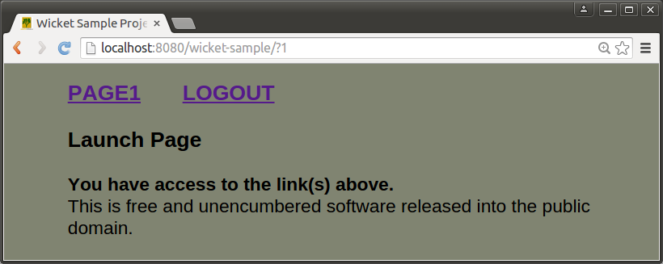

# wicket-sample ENABLE FORTRESS README

 This document demonstrates how to enable java EE and fortress security in the wicket sample app.

-------------------------------------------------------------------------------

## Prerequisites for target machine:
1. Debian or Redhat Liunx machine with OpenSSL installed.

2. Java 7 (or greater) sdk

3. Git

4. Apache Maven 3

5. Firefox Web Browser

6. Completion of the [Apache Fortress Ten Minute Guide](http://symas.com/javadocs/apache-fortress-core/org/apache/directory/fortress/core/doc-files/ten-minute-guide.html):
    * [Setup Apache Directory Server](http://symas.com/javadocs/apache-fortress-core/org/apache/directory/fortress/core/doc-files/apache-directory-server.html)
    * [Setup Apache Directory Studio](http://symas.com/javadocs/apache-fortress-core/org/apache/directory/fortress/core/doc-files/apache-directory-studio.html)
    * [Build Apache Fortress Core](http://symas.com/javadocs/apac1he-fortress-core/org/apache/directory/fortress/core/doc-files/apache-fortress-core.html)
    * [Build Apache Fortress Realm](http://symas.com/javadocs/apache-fortress-core/org/apache/directory/fortress/core/doc-files/apache-fortress-realm.html)
    * [Setup Apache Tomcat Web Server](http://symas.com/javadocs/apache-fortress-core/org/apache/directory/fortress/core/doc-files/apache-tomcat.html)
    * [Build Apache Fortress Web](http://symas.com/javadocs/apache-fortress-core/org/apache/directory/fortress/core/doc-files/apache-fortress-web.html)

-------------------------------------------------------------------------------

## Steps to enable java EE and fortress security:

1. Add the static /login html files

 * If you downloaded the wicket-sample source, this is already taken care of.

2. Add LoginPage, LogoutPage java and html

 * Again these are already part of the wicket-sample source distro.

3. Edit the pom.xml
    * uncomment the dependencies near the top
```
        <!-- TODO STEP 3: uncomment for fortress & security dependencies: -->
        <dependency>
            <groupId>org.apache.directory</groupId>
            <artifactId>fortress-web</artifactId>
            <version>${project.version}</version>
            <classifier>classes</classifier>
        </dependency>

        <dependency>
            <groupId>org.springframework</groupId>
            <artifactId>spring-web</artifactId>
            <version>${spring.version}</version>
        </dependency>

        <dependency>
            <groupId>org.springframework</groupId>
            <artifactId>spring-expression</artifactId>
            <version>${spring.version}</version>
        </dependency>

        <dependency>
            <groupId>xml-apis</groupId>
            <artifactId>xml-apis</artifactId>
            <version>1.4.01</version>
        </dependency>

```

    * uncomment the maven ant task near the bottom
```
...
    <plugin>
        <artifactId>maven-antrun-plugin</artifactId>
        <version>1.7</version>
        <executions>
            <execution>
                <phase>test</phase>
                <configuration>
                    <target name="fortress-load"
...
```

 Now the necessary binaries will be available to the app.

4. Edit the web.xml
    * uncomment the spring settings
    * uncomment the java ee security constraints

 After this step, java EE security has been enabled.

5. Rename context.xml.example to context.xml

 The context.xml is how the fortress realm integrates with the sample wicket application.
6. Rename fortress.properties.example to fortress.properties.

 After completing the fortress ten minute guide, this step should be familiar to you.  It is where the fortress runtime is connected with a remote ldap server.

7. Edit WicketApplication.java
    * uncomment fortress session override
    * uncomment fortress spring bean injector

 These steps are necessary to get fortress hooked into the sample app.

8. Edit WicketSampleBasePage.java
    * uncomment fortress spring bean injection

     These beans are how the app calls fortress
    * uncomment call to enableFortress

     Needed to manage the sessions on behalf of the users.
    * change to FtBookmarkablePageLink

 This component maps the page links to fortress permissions.

9. Edit Page1.java, Page2.java, Page3.java
    * change to FtIndicatingAjaxButton

 This component maps the page buttons to fortress permissions

10. Build & Deploy (run from the command line):

 Build the web app, loads the wicket sample security policy into ldap, and deploy into tomcat:
```
mvn clean tomcat:deploy
```
-------------------------------------------------------------------------------

## To test: sign on with creds:
* wssuperuser/password
   


* wsuser1/password
   


* wsuser2/password
   


* wsuser3/password
   