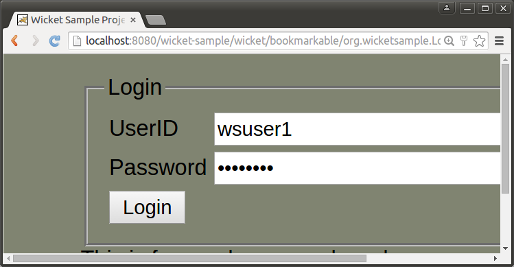
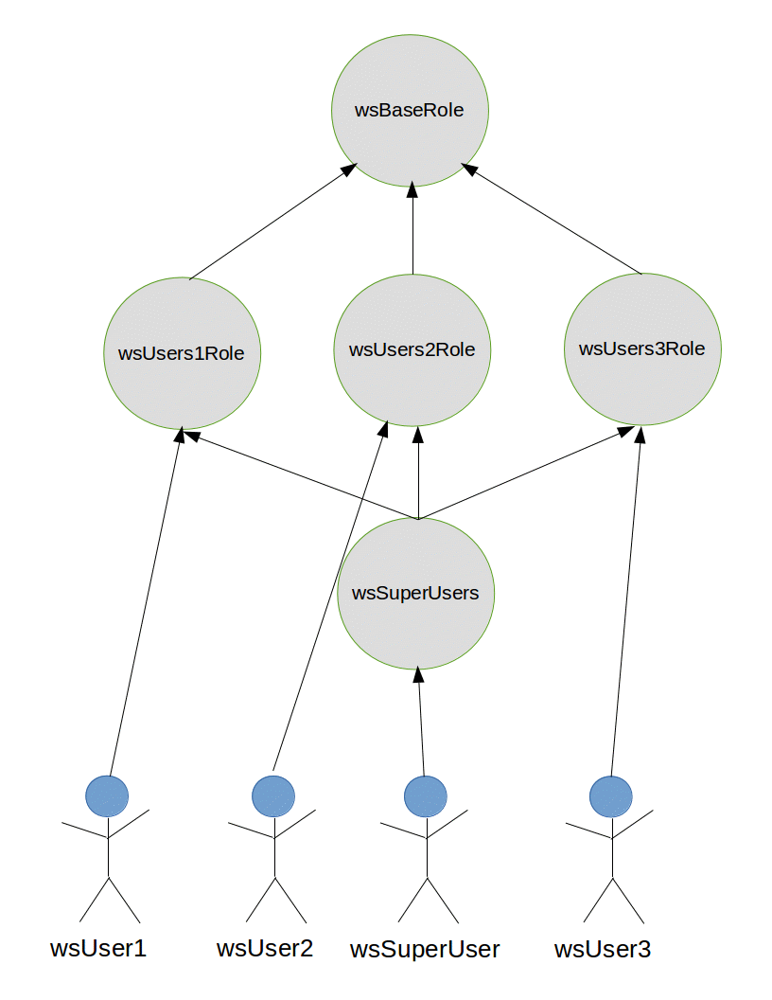
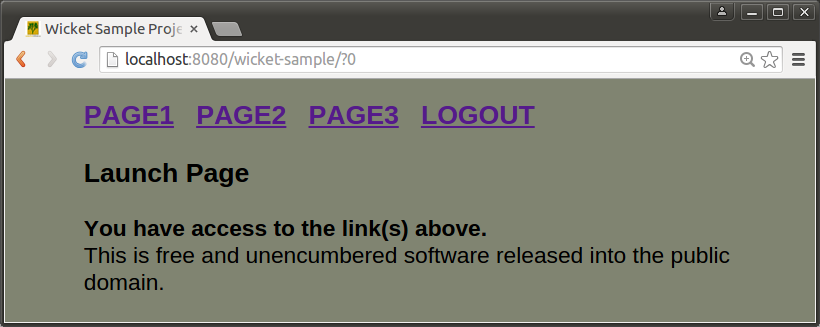

# wicket-sample README-ENABLE-FORTRESS

 This document demonstrates how to enable java EE and fortress security for the wicket sample app.

-------------------------------------------------------------------------------

## Prerequisites for target machine:
1. Debian or Redhat Liunx machine with OpenSSL installed.

2. Java 7 (or greater) sdk

3. Git

4. Apache Maven 3

5. Firefox Web Browser

6. Completion of the [Apache Fortress Ten Minute Guide](http://symas.com/javadocs/apache-fortress-core/org/apache/directory/fortress/core/doc-files/ten-minute-guide.html):
    * [Setup Apache Directory Server](http://symas.com/javadocs/apache-fortress-core/org/apache/directory/fortress/core/doc-files/apache-directory-server.html)
    * [Setup Apache Directory Studio](http://symas.com/javadocs/apache-fortress-core/org/apache/directory/fortress/core/doc-files/apache-directory-studio.html)
    * [Build Apache Fortress Core](http://symas.com/javadocs/apac1he-fortress-core/org/apache/directory/fortress/core/doc-files/apache-fortress-core.html)
    * [Build Apache Fortress Realm](http://symas.com/javadocs/apache-fortress-core/org/apache/directory/fortress/core/doc-files/apache-fortress-realm.html)
    * [Setup Apache Tomcat Web Server](http://symas.com/javadocs/apache-fortress-core/org/apache/directory/fortress/core/doc-files/apache-tomcat.html)
    * [Build Apache Fortress Web](http://symas.com/javadocs/apache-fortress-core/org/apache/directory/fortress/core/doc-files/apache-fortress-web.html)

-------------------------------------------------------------------------------

## Instructions for enabling security inside wicket-sample app

1. Completion of steps in wicket-sample [README.md](README.md)

2.  Add the Java EE security required artifacts

 If you are using the wicket-sample source, this is already done.  It includes wicket components
 [LoginPage.java](src/main/java/org/wicketsample/LoginPage.java), [LogoutPage.java](src/main/java/org/wicketsample/LogoutPage.java)
 (plus associated markup files [LoginPage.html](src/main/resources/org/wicketsample/LoginPage.html), [LogoutPage.html](src/main/resources/org/wicketsample/LogoutPage.html)),
 and the static html files under the src/main/webapp/login folder.  These files control the flow between the container and wicket with java EE security enabled.


 

3. Edit the [pom.xml](pom.xml)

 Prepare maven for fortress.
  * uncomment the dependencies near the top
  ```xml
        ...
        <!-- TODO STEP 3: uncomment for fortress & security dependencies: -->
        <dependency>
            <groupId>org.apache.directory</groupId>
            <artifactId>fortress-web</artifactId>
            <version>${project.version}</version>
            <classifier>classes</classifier>
        </dependency>

        <dependency>
            <groupId>org.springframework</groupId>
            <artifactId>spring-web</artifactId>
            <version>${spring.version}</version>
        </dependency>

        <dependency>
            <groupId>org.springframework</groupId>
            <artifactId>spring-expression</artifactId>
            <version>${spring.version}</version>
        </dependency>

        <dependency>
            <groupId>xml-apis</groupId>
            <artifactId>xml-apis</artifactId>
            <version>1.4.01</version>
        </dependency>
        ...
  ```
  * uncomment the maven ant task near the bottom

 This plugin calls the fortress load procedure during normal maven tasks like install or deploy.  The fortress load inserts the app’s security policy into ldap.
 The dataload can be switched off by passing param -Dnoload which tells the plugin not to execute.
  ```xml
    ...
    <plugin>
        <artifactId>maven-antrun-plugin</artifactId>
        <version>1.7</version>
        <executions>
            <execution>
                <phase>test</phase>
                <configuration>
                    <target name="fortress-load"
    ...
 ```
 At the completion of this step, the necessary binaries will be available to the app and the app’s security policy file will be ready to load.

4. Edit the [web.xml](src/main/webapp/WEB-INF/web.xml)

 Prepare the app for fortress.
  * uncomment the spring settings
 ```xml
  <!-- TODO STEP 4a: uncomment to enable fortress spring bean injection: -->
  <context-param>
      <param-name>contextConfigLocation</param-name>
      <param-value>classpath:applicationContext.xml</param-value>
  </context-param>

  <listener>
      <listener-class>org.springframework.web.context.ContextLoaderListener</listener-class>
  </listener>

 ```
 Notice a reference to spring's context file: [ApplicationContext.xml](src/main/resources/applicationContext.xml).
 It holds the metadata necessary to wire the fortress objects in with their constructors and subsequently get injected into the web app as spring beans.
 ```xml
 <?xml version="1.0" encoding="UTF-8"?>
 <beans xmlns="http://www.springframework.org/schema/beans"
        xmlns:xsi="http://www.w3.org/2001/XMLSchema-instance"
        xsi:schemaLocation="http://www.springframework.org/schema/beans
         http://www.springframework.org/schema/beans/spring-beans.xsd
         http://www.springframework.org/schema/beans
         http://www.springframework.org/schema/beans/spring-beans-3.0.xsd">

     <!-- The Fortress Access Manager bean used for IAM -->
     <bean id="accessMgr" class="org.apache.directory.fortress.core.AccessMgrFactory" scope="prototype"
           factory-method="createInstance">
         <constructor-arg value="HOME"/>
     </bean>
     <!-- The Fortress Realm J2EE Manager bean used for deserializing the principal as returned from tomcat -->
     <bean id="j2eePolicyMgr" class="org.apache.directory.fortress.realm.J2eePolicyMgrFactory" scope="prototype"
           factory-method="createInstance">
     </bean>

 </beans>
 ```

  * uncomment the java ee security constraints
 ```xml
    ...
    <!-- TODO STEP 4b: uncomment to enable Java EE Security -->
    <security-constraint>
        <web-resource-collection>
            <web-resource-name>app</web-resource-name>
            <url-pattern>/wicket/bookmarkable/org.wicketsample.LogoutPage</url-pattern>
        </web-resource-collection>
        &lt;!&ndash; OMIT auth-constraint &ndash;&gt;
    </security-constraint>
    <security-constraint>
        <display-name>Wicket Sample Security Constraints</display-name>
        <web-resource-collection>
            <web-resource-name>Protected Area</web-resource-name>
            <url-pattern>/wicket/*</url-pattern>
        </web-resource-collection>
        <auth-constraint>
            <role-name>wsBaseRole</role-name>
        </auth-constraint>
    </security-constraint>
    <login-config>
        <auth-method>FORM</auth-method>
        <realm-name>FortressRealm</realm-name>
        <form-login-config>
            <form-login-page>/login/login.html</form-login-page>
            <form-error-page>/login/error.html</form-error-page>
        </form-login-config>
    </login-config>
    <security-role>
        <role-name>wsBaseRole</role-name>
    </security-role>

    <error-page>
        <error-code>403</error-code>
        <location>/login/unauthorized.html</location>
    </error-page>
    <error-page>
        <error-code>404</error-code>
        <location>/login/pagenotfound.html</location>
    </error-page>
    <error-page>
        <error-code>500</error-code>
        <location>/login/unexpected.html</location>
    </error-page>
    ...
 ```

 Now container security has been enabled for this web app.  It authenticates, checks roles and maintains the session.

 The wicket logout page is excluded from java EE security constraints.  Otherwise, a problem occurs preventing unauthorized users from logging out.

 ```xml
 <security-constraint>
    <web-resource-collection>
        <web-resource-name>app</web-resource-name>
        <url-pattern>/wicket/bookmarkable/org.wicketsample.LogoutPage</url-pattern>
    </web-resource-collection>
    <!-- OMIT auth-constraint -->
 </security-constraint>
 ```


5. Rename [context.xml.example](src/main/resources/META-INF/context.xml.example) to context.xml

 Prepare the app for the fortress realm.
 ```xml
    <Context reloadable="true">

        <Realm className="org.apache.directory.fortress.realm.tomcat.Tc7AccessMgrProxy"
               debug="0"
               resourceName="UserDatabase"
               defaultRoles=""
               containerType="TomcatContext"
               realmClasspath=""
                />
    </Context>
 ```

 This file hooks a web app into the tomcat fortress realm which performs security functions like authenticate and isUserInRole.
 It’s also where the security session gets created by fortress.

 ####more on the realm:
 The fortress realm’s proxy jar must be present under tomcat’s lib folder
 (as discussed in the [Apache Fortress Ten Minute Guide](http://symas.com/javadocs/apache-fortress-core/org/apache/directory/fortress/core/doc-files/ten-minute-guide.html)).

 The proxy is a shim that uses a [URLClassLoader](http://docs.oracle.com/javase/7/docs/api/java/net/URLClassLoader.html) to reach its implementation libs.  It prevents
 the realm impl libs, pulled in as dependency to web app, from interfering with the container’s system classpath thus providing an error free deployment process free from
 classloader issues.  The proxy offers the flexibility for each web app to determine its own version/type of security realm to use, satisfying a variety of requirements
 related to web hosting and multitenancy.

6. Rename [fortress.properties.example](src/main/resources/fortress.properties.example) to fortress.properties.

 Prepare fortress for ldap server usage.

 After completing the fortress ten minute guide, this step should be familiar to you.  It is how the fortress runtime gets hooked in with a remote ldap server.
 ```properties
# This param tells fortress what type of ldap server in use:
ldap.server.type=apacheds

# Use value from [Set Hostname Entry]:
host=localhost

# if ApacheDS is listening on TLS port:
port=10389

# These credentials are used for read/write access to all nodes under suffix:
admin.user=uid=admin,ou=system
admin.pw=secret

# This is min/max settings for LDAP administrator pool connections that have read/write access to all nodes under suffix:
min.admin.conn=1
max.admin.conn=10

# This node contains fortress properties stored on behalf of connecting LDAP clients:
config.realm=DEFAULT
config.root=ou=Config,dc=example,dc=com

# Used by application security components:
perms.cached=true

# Fortress uses a cache:
ehcache.config.file=ehcache.xml
 ```

 After completing the fortress ten minute guide, this step should be familiar to you.  It is where the fortress runtime is connected with a remote ldap server.

7. Edit [WicketApplication.java](src/main/java/org/wicketsample/WicketApplication.java)

 Tell wicket about fortress sessions and objects.
    * uncomment fortress session override

 Here we override app’s wicket session with a new one that can hold onto fortress session and perms:
 ```java
	// TODO STEP 7a: uncomment save fortress session to wicket session:
	@Override
	public Session newSession(Request request, Response response)
	{
		return new WicketSession(request);
	}
 ```

    * uncomment fortress spring bean injector

 Next we tell the app to use spring to inject references to fortress security objects:
 ```java
    // TODO STEP 7b: uncomment to enable injection of fortress spring beans:
    getComponentInstantiationListeners().add(new SpringComponentInjector(this));
 ```

 These steps are necessary to get fortress hooked into the sample app.

8. Edit [WicketSampleBasePage.java](src/main/java/org/wicketsample/WicketSampleBasePage.java)

 Get fortress objects injected to the wicket base page, enable fortress secured page links.
    * uncomment fortress spring bean injection
 ```java
    // TODO STEP 8a: enable spring injection of fortress bean here:
    @SpringBean
    private AccessMgr accessMgr;

    @SpringBean
    private J2eePolicyMgr j2eePolicyMgr;

 ```
 These objects are used by the app to make AccessMgr calls to functions like checkAccess and sessionPermissions.

    * uncomment call to enableFortress

 This performs the boilerplate security functions required by fortress during app session startup:
 ```java
    // TODO STEP 8b: uncomment call to enableFortress:
    try
    {
        SecUtils.enableFortress( this, ( HttpServletRequest ) getRequest().getContainerRequest(), j2eePolicyMgr, accessMgr );
    }
    catch (org.apache.directory.fortress.core.SecurityException se)
    {
        String error = "WicketSampleBasePage caught security exception : " + se;
        LOG.warn( error );
    }
 ```
    * change to FtBookmarkablePageLink

 The advantage here is other than a name change, everything else stays the same, and now the links are secured.
 ```java
        // TODO STEP 8c: change to FtBookmarkablePageLink:
        add( new FtBookmarkablePageLink( "page1.link", Page1.class ) );
        add( new FtBookmarkablePageLink( "page2.link", Page2.class ) );
        add( new FtBookmarkablePageLink( "page3.link", Page3.class ) );
 ```

 This component maps a page link to a fortress permission.  The wicket id passed in, e.g. page1.link, is converted to a fortress permission, objName: page1, opName: link.

9. Edit [Page1.java](src/main/java/org/wicketsample/Page1.java), [Page2.java](src/main/java/org/wicketsample/Page2.java), [Page3.java](src/main/java/org/wicketsample/Page3.java)

 Enable fortress secured buttons.  Each page has three buttons.  Same as before, only the name changes.
    * change to FtIndicatingAjaxButton
 ```java
    // TODO STEP 9a: change to FtIndicatingAjaxButton:
    add( new FtIndicatingAjaxButton( "page1.button1" )
 ```

 This component maps the buttons to fortress permissions.  The wicket id, e.g. page1.button1, is converted to a fortress permission, objName: page1, opName: button1.

10. Build & Deploy (run from the command line):

 Deploy to tomcat server:
 ```maven
mvn clean tomcat:deploy
 ```

 Or if already deployed:
 ```maven
mvn clean tomcat:redeploy
 ```

 This step also loads the wicket sample security policy into ldap.  Since the load needs to happen just once, you can turn it off by passing a value of
 -Dnoload on subsequent deployments:
 ```maven
mvn tomcat:redeploy -Dnoload
 ```

-------------------------------------------------------------------------------

## How to test the wicket sample with security enabled

1. Here is the user to role assignments:

 

2. Point your web browser to the following location: 

3. Use the following creds:

 * wssuperuser/password
   


 * wsuser1/password
   


 * wsuser2/password
   


 * wsuser3/password
   

4. click on the page links

5. click on the buttons

6. Notice that security is now enabled, and how each user has different access rights.